# 🌐 QA Injective MM Bot - Web Dashboard

> **Modern web interface for real-time bot monitoring and control**

A sophisticated web dashboard built with FastAPI and modern frontend technologies, providing real-time monitoring, control, and analytics for the QA Injective MM Bot.

## 🎯 Overview

The web dashboard provides a comprehensive interface for:
- **Real-time bot monitoring** with live status updates
- **Wallet balance tracking** across all configured wallets
- **Market data visualization** with current trading pairs
- **Live activity feed** showing all trading operations
- **Bot control interface** for starting/stopping operations
- **Network status display** showing current network (Testnet/Mainnet)

## 🏗️ Architecture

### 🎨 Frontend Stack
- **HTML5** - Semantic markup structure
- **Tailwind CSS** - Utility-first CSS framework for modern styling
- **Vanilla JavaScript** - Real-time WebSocket communication
- **Responsive Design** - Mobile-first approach for all devices

### 🚀 Backend Stack
- **FastAPI** - Modern, fast web framework for building APIs
- **WebSocket** - Real-time bidirectional communication
- **Uvicorn** - ASGI server for production deployment
- **Python 3.8+** - Core runtime environment

### 🔄 Data Flow

```mermaid
graph LR
    subgraph "🌐 Browser"
        UI[📱 Web Interface]
        WS[⚡ WebSocket Client]
    end
    
    subgraph "🚀 FastAPI Server"
        API[🔌 REST API]
        WSS[⚡ WebSocket Server]
        BOT[🤖 Bot Controller]
    end
    
    subgraph "🤖 Trading System"
        ENGINE[📱 Trading Engine]
        LOGS[📝 Log Files]
        CONFIG[⚙️ Configuration]
    end
    
    UI --> API
    UI --> WS
    WS <--> WSS
    WSS --> BOT
    BOT --> ENGINE
    BOT --> LOGS
    BOT --> CONFIG
    
    ENGINE --> WSS
    LOGS --> WSS
```



## 🚀 Quick Start

### 📋 Prerequisites
- Python 3.8 or higher
- Virtual environment activated
- All dependencies installed from main project

### 🛠️ Installation

1. **Navigate to web directory**:
```bash
cd web
```

2. **Install web-specific dependencies**:
```bash
pip install -r requirements.txt
```

3. **Start the web server**:
```bash
python app.py
```

4. **Access the dashboard**:
- Open your browser and navigate to: `http://localhost:8000`
- The dashboard will automatically connect and start displaying real-time data

## 🎮 Dashboard Features

### 📊 Bot Status Panel
- **Real-time Status Indicator**: Green dot for running, red for stopped
- **Uptime Display**: Shows how long the bot has been running
- **Start Time**: When the bot was last started
- **Network Status**: Displays current network (Testnet/Mainnet)

### 💰 Wallet Balances
- **Live Balance Updates**: Real-time balance tracking for all wallets
- **Token Breakdown**: Detailed view of all tokens per wallet
- **Summary View**: Quick overview of total balances
- **Manual Refresh**: Button to force balance updates

### 📈 Market Information
- **Enabled Markets**: Shows all configured trading pairs
- **Market Status**: Real-time market data and status
- **Trading Pairs**: Current active markets being monitored

### 📝 Live Activity Feed
- **Real-time Logs**: Live streaming of all bot activities
- **Trading Events**: Order placements, cancellations, and results
- **System Events**: Bot status changes and errors
- **Full Log Viewer**: Modal window with complete log history

### 🎛️ Control Interface
- **Start Bot**: Green button to initiate trading operations
- **Stop Bot**: Red button to halt all trading activities
- **Status Updates**: Real-time feedback on control actions

## 🔧 Technical Details

### 🌐 WebSocket Communication

The dashboard uses WebSocket for real-time updates:

```javascript
// WebSocket connection
const ws = new WebSocket('ws://localhost:8000/ws');

// Real-time data handling
ws.onmessage = function(event) {
    const data = JSON.parse(event.data);
    updateDashboard(data);
};
```

### 📊 API Endpoints

| Endpoint | Method | Description |
|----------|--------|-------------|
| `/` | GET | Main dashboard page |
| `/api/status` | GET | Current bot status and system info |
| `/api/balances` | GET | Wallet balance information |
| `/api/control` | POST | Start/stop bot operations |
| `/api/logs` | GET | Trading log data |
| `/ws` | WebSocket | Real-time data stream |

### 🎨 UI Components

#### Status Indicator
```html
<div id="status-indicator" class="flex items-center">
    <span class="status-indicator status-running"></span>
    <span id="status-text" class="text-sm font-medium">RUNNING</span>
</div>
```

#### Balance Display
```html
<div class="balance-card">
    <h3 class="wallet-name">Primary Market Maker</h3>
    <div class="token-list">
        <div class="token-item">
            <span class="token-symbol">INJ</span>
            <span class="token-balance">93,278.23</span>
        </div>
    </div>
</div>
```

## 🔒 Security Features

### 🛡️ Data Protection
- **No sensitive data exposure**: Private keys never transmitted to frontend
- **Secure API endpoints**: All endpoints require proper authentication
- **Input validation**: All user inputs are validated and sanitized
- **CORS protection**: Configured for secure cross-origin requests

### 🔐 Access Control
- **Local network only**: Default configuration for localhost access
- **Environment-based config**: Secure configuration management
- **Log sanitization**: Sensitive data filtered from logs

## 📱 Responsive Design

### 🖥️ Desktop Features
- **Full dashboard view**: All panels visible simultaneously
- **Advanced controls**: Detailed configuration options
- **Multi-column layout**: Efficient use of screen space

### 📱 Mobile Features
- **Touch-friendly interface**: Optimized for mobile interaction
- **Collapsible panels**: Space-efficient mobile layout
- **Swipe gestures**: Intuitive mobile navigation
- **Responsive charts**: Adaptive data visualization

## 🚀 Deployment

### 🏠 Local Development
```bash
# Development server with auto-reload
python app.py --reload
```

### 🌐 Production Deployment
```bash
# Production server with Uvicorn
uvicorn app:app --host 0.0.0.0 --port 8000 --workers 4
```

### 🐳 Docker Deployment
```dockerfile
FROM python:3.9-slim
WORKDIR /app
COPY requirements.txt .
RUN pip install -r requirements.txt
COPY . .
EXPOSE 8000
CMD ["uvicorn", "app:app", "--host", "0.0.0.0", "--port", "8000"]
```

## 🔧 Configuration

### ⚙️ Environment Variables
```bash
# Web server configuration
WEB_HOST=0.0.0.0
WEB_PORT=8000
WEB_DEBUG=false

# Bot integration
BOT_SCRIPT_PATH=../scripts/multi_wallet_trader.py
CONFIG_PATH=../config/markets_config.json
LOG_PATH=../logs/trading.log
```

### 🎨 Customization
- **Theme colors**: Modify Tailwind CSS classes
- **Layout structure**: Update HTML templates
- **API endpoints**: Extend FastAPI routes
- **WebSocket events**: Add custom real-time features

## 🐛 Troubleshooting

### 🔧 Common Issues

1. **WebSocket Connection Failed**
   - Check if the web server is running
   - Verify firewall settings
   - Ensure port 8000 is available

2. **Bot Status Not Updating**
   - Check bot process is running
   - Verify log file permissions
   - Restart web server

3. **Balance Data Not Loading**
   - Ensure wallet configuration is correct
   - Check network connectivity
   - Verify API endpoint responses

### 📝 Debug Mode
```bash
# Enable debug logging
python app.py --debug

# Check WebSocket connections
# Open browser developer tools and monitor Network tab
```

## 🔮 Future Enhancements

### 🚀 Planned Features
- **📊 Advanced Analytics**: Detailed performance metrics and charts
- **🎯 Strategy Configuration**: Web-based strategy parameter adjustment
- **📈 Real-time Charts**: Live price and trading volume visualization
- **🔔 Alert System**: Custom notifications for important events
- **📱 Mobile App**: Native mobile application
- **🌐 Multi-language Support**: Internationalization support

### 🛠️ Technical Improvements
- **⚡ Performance Optimization**: Faster data loading and rendering
- **🔒 Enhanced Security**: Additional authentication and authorization
- **📊 Data Persistence**: Historical data storage and analysis
- **🔄 Auto-scaling**: Dynamic resource allocation
- **📈 Monitoring**: Advanced system health monitoring

## 📞 Support

For technical support or feature requests:
- Check the main project README for general bot issues
- Review browser console for frontend errors
- Monitor server logs for backend issues
- Ensure all dependencies are properly installed

---

**Built with ❤️ for the Injective ecosystem**

*The web dashboard provides a modern, intuitive interface for monitoring and controlling your market making operations. Enjoy real-time insights and seamless bot management!* 🚀
